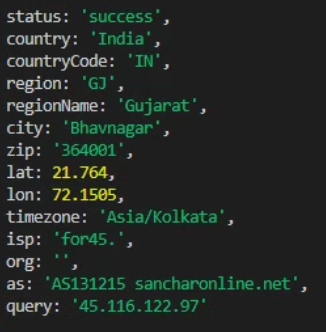

# Leave-tracking Project
It is product of SAAS 

## How to setup 
clone the the repo 
```sh
   git clone https://github.com/Sucomp-TechSolutions/Leave-tracking.git 
```

## backend
### prerequisites
1. Node vesion 20 

    [Node-20-v](https://nodejs.org/en/download)
2. mongodb database 
3. VS code 

steps

create .env file and add the environment variables inside backend folder
```sh 
    cd leave-tracking
    cd backend 
    npm install
    npm run dev
```
## Frontend
### prerequisites
1. Node vesion 20 


[Installation](doc1/installation.md)

| Name  | Age | Country  |
|-------|-----|----------|
| Alex  | 30  | USA      |
| Sara  | 28  | Canada   |


